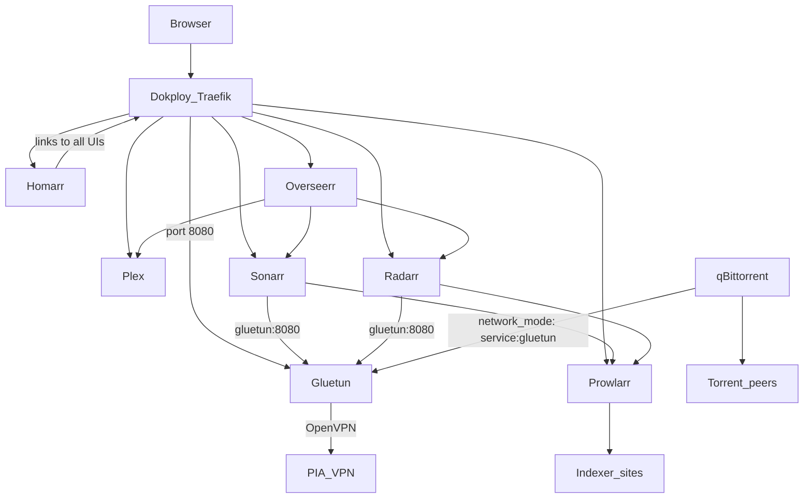

# Plex + *arr Media Stack for Dokploy

## Architecture

Only **qBittorrent** routes through the VPN. Sonarr, Radarr, Prowlarr, and Plex stay on the normal Docker network so indexer APIs and streaming stay reliable. Gluetun provides a built-in kill switch: if the VPN drops, qBittorrent loses all network access.



## Files to create

All files in [`/home/matt/explore/wsl`](/home/matt/explore/wsl) (empty workspace today):

| File | Purpose |
|------|---------|
| `docker-compose.yml` | Full stack definition |
| `.env.example` | Documented template (no secrets) |
| `.env` | Your real values (gitignored) |

You will set `MEDIA_ROOT` and `CONFIG_ROOT` to your custom paths before first deploy.

## Image choices (linuxserver.io priority)

| Service | Image | Notes |
|---------|-------|-------|
| Plex | `lscr.io/linuxserver/plex:latest` | Bridge mode (not host) for Dokploy compatibility |
| qBittorrent | `lscr.io/linuxserver/qbittorrent:latest` | libtorrent v2 |
| Sonarr | `lscr.io/linuxserver/sonarr:latest` | |
| Radarr | `lscr.io/linuxserver/radarr:latest` | |
| Prowlarr | `lscr.io/linuxserver/prowlarr:latest` | |
| Overseerr | `lscr.io/linuxserver/overseerr:latest` | Request/search UI; connects to Plex + Sonarr + Radarr |
| Homarr | `ghcr.io/homarr-labs/homarr:latest` | Single dashboard for all services (no linuxserver image) |
| Gluetun | `qmcgaw/gluetun:latest` | **Required exception** — linuxserver/wireguard is a VPN *server*, not a PIA client |

Hotio (`hotio.dev`) is not needed. Homarr and Gluetun are the only non-linuxserver images.

## Centralized environment (`.env`)

Single file with all configuration, referenced via `${VAR}` in compose:

```bash
# --- Identity / paths ---
PUID=1000
PGID=1000
TZ=America/New_York
MEDIA_ROOT=/your/custom/media/path
CONFIG_ROOT=/your/custom/config/path

# --- PIA VPN (Gluetun) ---
OPENVPN_USER=p1234567
OPENVPN_PASSWORD=your_pia_password
SERVER_REGIONS=CA Toronto          # Non-US; PIA port-forwarding unavailable on US servers
VPN_PORT_FORWARDING=on

# --- Network allowlists for Gluetun firewall ---
LAN_SUBNET=192.168.1.0/24          # Your home LAN
DOCKER_SUBNET=10.0.0.0/8           # Broad Docker range; tighten to dokploy-network CIDR if known

# --- Plex ---
PLEX_CLAIM=                        # Get from https://plex.tv/claim (expires in 4 min)

# --- qBittorrent ---
WEBUI_PORT=8080
```

In Dokploy: paste these same variables into the **Environment** tab for the project. Compose will substitute them; services only receive the vars explicitly listed in their `environment:` blocks (VPN creds stay scoped to Gluetun).

## Storage layout (hardlink-friendly)

Use one shared root mount so Sonarr/Radarr can hardlink completed torrents into the library (instant, no duplicate disk usage):

```
${MEDIA_ROOT}/
  torrents/          # qBittorrent downloads here
    movies/
    tv/
  media/
    movies/          # Radarr final library
    tv/              # Sonarr final library

${CONFIG_ROOT}/
  plex/ sonarr/ radarr/ prowlarr/ overseerr/ homarr/ qbittorrent/ gluetun/
```

All services mount `${MEDIA_ROOT}:/data` (and `${CONFIG_ROOT}/<app>:/config`).

## docker-compose.yml structure

### Shared network

```yaml
networks:
  dokploy-network:
    external: true
```

Every routable service joins `dokploy-network`. **Do not set `container_name`** (Dokploy recommendation — breaks logs/metrics).

### Gluetun (VPN gateway + qBit web UI endpoint)

```yaml
gluetun:
  image: qmcgaw/gluetun:latest
  cap_add: [NET_ADMIN]
  devices: [/dev/net/tun:/dev/net/tun]
  environment:
  - VPN_SERVICE_PROVIDER=private internet access
  - VPN_TYPE=openvpn
  - OPENVPN_USER=${OPENVPN_USER}
  - OPENVPN_PASSWORD=${OPENVPN_PASSWORD}
  - SERVER_REGIONS=${SERVER_REGIONS}
  - VPN_PORT_FORWARDING=${VPN_PORT_FORWARDING}
  - FIREWALL_OUTBOUND_SUBNETS=${LAN_SUBNET},${DOCKER_SUBNET}
  - TZ=${TZ}
  # Auto-sync PIA forwarded port to qBittorrent (official Gluetun wiki pattern)
  - VPN_PORT_FORWARDING_UP_COMMAND=/bin/sh -c 'wget -O- -nv --retry-connrefused --post-data "json={\"listen_port\":{{PORT}},\"current_network_interface\":\"{{VPN_INTERFACE}}\",\"random_port\":false,\"upnp\":false}" http://127.0.0.1:${WEBUI_PORT}/api/v2/app/setPreferences'
  volumes:
  - ${CONFIG_ROOT}/gluetun:/gluetun
  networks: [dokploy-network]
  healthcheck:
    test: ["CMD", "/gluetun-entrypoint", "healthcheck"]
    interval: 30s
    timeout: 10s
    retries: 5
  restart: unless-stopped
```

No `ports:` block on Gluetun — Dokploy Traefik handles external access.

### qBittorrent (VPN-only, kill-switched)

```yaml
qbittorrent:
  image: lscr.io/linuxserver/qbittorrent:latest
  network_mode: service:gluetun          # Cannot also join dokploy-network
  depends_on:
    gluetun:
      condition: service_healthy
  environment:
  - PUID=${PUID}
  - PGID=${PGID}
  - TZ=${TZ}
  - WEBUI_PORT=${WEBUI_PORT}
  volumes:
  - ${CONFIG_ROOT}/qbittorrent:/config
  - ${MEDIA_ROOT}:/data
  restart: unless-stopped
```

**Critical:** qBittorrent has no `networks:` or `ports:` — all traffic goes through Gluetun. If VPN fails, downloads stop (no leak).

### Plex, Sonarr, Radarr, Prowlarr, Overseerr (normal network)

Standard linuxserver pattern: `PUID`, `PGID`, `TZ`, config volume, `/data` mount (where applicable), `dokploy-network`, `restart: unless-stopped`.

Plex additionally gets `PLEX_CLAIM=${PLEX_CLAIM}` on first run to link your account.

Overseerr only needs a config volume (no media mount).

### Homarr (dashboard)

```yaml
homarr:
  image: ghcr.io/homarr-labs/homarr:latest
  environment:
  - TZ=${TZ}
  volumes:
  - ${CONFIG_ROOT}/homarr:/appdata
  networks: [dokploy-network]
  restart: unless-stopped
```

Homarr is your primary entry point — bookmark one URL and link out to every other service from the dashboard.

Internal service ports for Dokploy domain configuration:

| Service | Container port |
|---------|---------------|
| **Homarr** | 7575 |
| Overseerr | 5055 |
| Plex | 32400 |
| Sonarr | 8989 |
| Radarr | 7878 |
| Prowlarr | 9696 |
| qBittorrent (via Gluetun) | 8080 |

## Dokploy deployment steps

1. **Create project** in Dokploy → Docker Compose → point at this repo / compose file.
2. **Set environment variables** from `.env` in the Dokploy Environment tab.
3. **Create host directories** for `MEDIA_ROOT` and `CONFIG_ROOT`; ensure ownership matches `PUID:PGID`.
4. **Deploy** the stack.
5. **Assign domains** via Dokploy Domains tab (recommended over manual Traefik labels):

| Service to attach domain to | Port | Example subdomain |
|----------------------------|------|-------------------|
| **`homarr`** | 7575 | `home.yourdomain.com` (primary bookmark) |
| `overseerr` | 5055 | `overseerr.yourdomain.com` |
| `plex` | 32400 | `plex.yourdomain.com` |
| `sonarr` | 8989 | `sonarr.yourdomain.com` |
| `radarr` | 7878 | `radarr.yourdomain.com` |
| `prowlarr` | 9696 | `prowlarr.yourdomain.com` |
| **`gluetun`** (not qbittorrent) | 8080 | `qbit.yourdomain.com` |

**Dokploy caveat:** Services using `network_mode: service:gluetun` cannot receive Dokploy domains. Attach the qBittorrent domain to **gluetun** instead ([Dokploy issue #663](https://github.com/Dokploy/dokploy/issues/663)).

6. **Post-deploy app configuration** (one-time in each web UI):
   - **Homarr** → add tiles for every service using their Dokploy domain URLs (Plex, Overseerr, Sonarr, Radarr, Prowlarr, qBittorrent).
   - **Overseerr** → sign in with Plex; connect Sonarr (`sonarr:8989`) and Radarr (`radarr:7878`) using internal Docker hostnames.
   - **Prowlarr** → Settings → Apps → add Sonarr + Radarr (use container hostnames `sonarr`, `radarr`).
   - **Sonarr / Radarr** → Settings → Download Clients → qBittorrent at host `gluetun`, port `8080`, category `tv` / `movies`.
   - **Sonarr / Radarr** → Settings → Media Management → enable hardlinks; root folders `/data/media/tv` and `/data/media/movies`.
   - **qBittorrent** → disable UPnP; enable "Bypass authentication for clients on localhost" (needed for Gluetun port-forward script); set default save path `/data/torrents`.
   - **Plex** → add libraries for `/data/media/movies` and `/data/media/tv`.

## Security and reliability best practices

- **VPN kill switch:** `network_mode: service:gluetun` ensures qBittorrent cannot reach the internet without VPN. No manual qBittorrent network-interface binding needed.
- **Scope VPN creds:** Only pass `OPENVPN_*` to the Gluetun service environment block.
- **PIA port forwarding:** Use a non-US `SERVER_REGIONS`; enables faster torrent seeding via Gluetun's native PIA integration.
- **HTTPS everywhere:** Dokploy Traefik + Let's Encrypt on all admin UIs.
- **Strong auth:** Change default qBittorrent password immediately (printed in container logs on first start). Set Sonarr/Radarr/Prowlarr authentication under Settings → General.
- **Restrict Prowlarr exposure:** Consider not exposing Prowlarr publicly if you only configure it once; access via VPN to your home network or Dokploy auth middleware.
- **Same filesystem:** Keep `torrents/` and `media/` on the same volume for hardlinks.
- **Updates:** Run `docker compose pull && docker compose up -d` periodically (linuxserver recommends against auto-updaters like Watchtower for their images).
- **Backup:** Back up `${CONFIG_ROOT}` (all app databases/settings). Media itself is re-downloadable but configs are not.

## What you need to provide before implementation

1. `MEDIA_ROOT` and `CONFIG_ROOT` absolute paths on the Dokploy host.
2. PIA username and password.
3. `PUID` / `PGID` from `id <your_user>` on the host.
4. Domain names for each service in Dokploy.
5. `PLEX_CLAIM` token at deploy time (generate immediately before first start).
