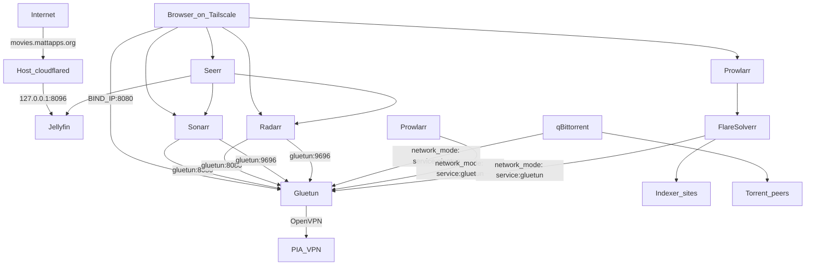

# Jellyfin + *arr Media Stack

A self-hosted media automation stack deployed via Docker Compose on [Dokploy](https://dokploy.com). Torrent downloads are routed exclusively through a PIA VPN kill switch; everything else runs on the normal Docker network for reliability.

**Jellyfin** is the only service exposed to the internet, at **https://movies.mattapps.org** via a host Cloudflare Tunnel. All other admin UIs bind to `${BIND_IP}` (your deploy host's private IP) and are not routed through Dokploy Traefik.

## Overview

| Service | Role |
|---------|------|
| **Seerr** | Search and request movies/TV shows |
| **Jellyfin** | Stream your library (public at `https://movies.mattapps.org` via Cloudflare Tunnel) |
| **Sonarr** | Automate TV show downloads and organization |
| **Radarr** | Automate movie downloads and organization |
| **Prowlarr** | Central indexer manager for Sonarr and Radarr |
| **FlareSolverr** | Cloudflare bypass for VPN-routed indexers (e.g. 1337x) |
| **qBittorrent** | Torrent client (VPN-only) |
| **Gluetun** | VPN gateway and kill switch for qBittorrent |

## Architecture

Only **qBittorrent**, **Prowlarr**, and **FlareSolverr** route through the VPN. Sonarr, Radarr, Jellyfin, and Seerr stay on the normal Docker network so inter-app APIs stay reliable. Gluetun provides a built-in kill switch: if the VPN drops, VPN-routed containers lose all network access.

Admin UIs for Seerr, Sonarr, Radarr, Prowlarr, and qBittorrent publish ports on `${BIND_IP}` (Tailscale or LAN IP). **Jellyfin** binds only to `127.0.0.1:8096` for the host `cloudflared` service — it is not reachable on `${BIND_IP}`.



### Download flow

1. You request content in **Seerr** (or add it directly in Sonarr/Radarr).
2. **Sonarr** or **Radarr** searches indexers via **Prowlarr**.
3. A matching torrent is sent to **qBittorrent** (reachable at `gluetun:8080` on the Docker network).
4. **qBittorrent** downloads the file through the **PIA VPN** tunnel managed by **Gluetun**.
5. On completion, Sonarr/Radarr import the file into your library using a **hardlink** (no duplicate disk usage).
6. **Jellyfin** picks up the new file and makes it available to stream.

## Project files

| File | Purpose |
|------|---------|
| `docker-compose.yml` | Full stack definition |
| `.env` | Your real configuration and secrets (gitignored) |
| `.env.example` | Documented template — copy to `.env` and fill in |
| `DOKPLOY-IMPLEMENTATION-GUIDE.md` | Step-by-step Dokploy deployment and configuration walkthrough |
| `.gitignore` | Excludes `.env` and local `config/` directories |

## Container images

| Service | Image | Notes |
|---------|-------|-------|
| Jellyfin | `lscr.io/linuxserver/jellyfin:10.11.11ubu2404-ls39` | `127.0.0.1:8096` only (cloudflared); public at `https://movies.mattapps.org` |
| qBittorrent | `lscr.io/linuxserver/qbittorrent:5.2.2_v2.0.13-ls464` | libtorrent v2 |
| Sonarr | `lscr.io/linuxserver/sonarr:4.0.19.2979-ls316` | |
| Radarr | `lscr.io/linuxserver/radarr:6.2.1.10461-ls308` | |
| Prowlarr | `lscr.io/linuxserver/prowlarr:2.4.0.5397-ls151` | VPN-routed via `network_mode: service:gluetun` |
| FlareSolverr | `ghcr.io/flaresolverr/flaresolverr:v3.5.0` | VPN-routed; Prowlarr reaches it at `http://127.0.0.1:8191` |
| Seerr | `ghcr.io/seerr-team/seerr:v3.3.0` | Config at `/app/config`; runs as UID 1000 |
| Gluetun | `qmcgaw/gluetun:latest@sha256:b0ee2135e6ba52ad3f102aae9663707cd1c9531485117067a380d3b2b6dd991d` | PIA OpenVPN client and kill switch (pinned by digest) |

All application images use [linuxserver.io](https://www.linuxserver.io/our-images) where available. Seerr and Gluetun are the exceptions. Image tags are pinned to specific versions for reproducible deployments; Gluetun is pinned by digest because it only publishes a rolling `latest` tag. Bump these tags deliberately rather than relying on `latest`.

## Prerequisites

- A [Dokploy](https://dokploy.com) instance (primary) with a remote deploy target running Docker Compose
- [Tailscale](https://tailscale.com/) on the deploy host (for private admin UI access)
- [cloudflared](https://developers.cloudflare.com/cloudflare-one/connections/connect-networks/) installed on the deploy host (for Jellyfin public access)
- A domain managed in Cloudflare (for the Jellyfin tunnel)
- An active [Private Internet Access](https://www.privateinternetaccess.com/) subscription
- Sufficient disk space for media and downloads on the same filesystem (required for hardlinks)

## Storage layout

Use one shared root mount so Sonarr and Radarr can hardlink completed torrents into the library without duplicating data on disk.

```
${MEDIA_ROOT}/
  torrents/              # qBittorrent downloads here
    movies/
    tv/
  media/
    movies/              # Radarr final library
    tv/                  # Sonarr final library

${CONFIG_ROOT}/
  jellyfin/
  sonarr/
  radarr/
  prowlarr/
  seerr/
  qbittorrent/
  gluetun/
```

Inside every container that mounts media, the path is `/data`. Config is at `/config` (linuxserver) or `/app/config` (Seerr).

### Create directories on the deploy host

Replace the paths with your actual `MEDIA_ROOT` and `CONFIG_ROOT` values:

```bash
export MEDIA_ROOT=/your/custom/media/path
export CONFIG_ROOT=/your/custom/config/path
export PUID=1000
export PGID=1000

mkdir -p ${MEDIA_ROOT}/torrents/{movies,tv,incomplete}
mkdir -p ${MEDIA_ROOT}/media/{movies,tv}
mkdir -p ${CONFIG_ROOT}/{jellyfin,sonarr,radarr,prowlarr,seerr,qbittorrent,gluetun}

chown -R ${PUID}:${PGID} ${MEDIA_ROOT} ${CONFIG_ROOT}
```

Get your UID/GID with `id your_user` on the host.

## Environment variables

All configuration lives in a single `.env` file. Copy `.env.example` to `.env` and fill in your values:

```bash
cp .env.example .env
```

| Variable | Description | Example |
|----------|-------------|---------|
| `PUID` | User ID for file ownership | `1000` |
| `PGID` | Group ID for file ownership | `1000` |
| `TZ` | Timezone | `America/New_York` |
| `MEDIA_ROOT` | Absolute path to media and downloads on the host | `/mnt/media` |
| `CONFIG_ROOT` | Absolute path to app config on the host | `/mnt/config` |
| `BIND_IP` | Bind address for admin UI ports. `0.0.0.0` exposes on all interfaces (LAN + Tailscale); a specific private IP (Tailscale `tailscale ip -4` or LAN IP) restricts access. Jellyfin is excluded. | `0.0.0.0` or `192.168.x.x` |
| `OPENVPN_USER` | PIA username | `p1234567` |
| `OPENVPN_PASSWORD` | PIA password | |
| `SERVER_REGIONS` | Comma-separated PIA regions with port forwarding (from PIA serverlist API; used with `PORT_FORWARD_ONLY` in compose) | see `.env.example` |
| `VPN_PORT_FORWARDING` | Enable PIA port forwarding in Gluetun | `on` |
| `LAN_SUBNET` | LAN + Tailscale CIDRs for Gluetun firewall (comma-separated) | `192.168.2.0/24,100.64.0.0/10` |
| `DOCKER_SUBNET` | Docker network CIDR (Gluetun firewall allowlist) | `10.0.0.0/8` |
| `JELLYFIN_PUBLISHED_SERVER_URL` | Public Jellyfin URL (Cloudflare Tunnel hostname) | `https://movies.mattapps.org` |
| `WEBUI_PORT` | qBittorrent web UI port | `8080` |
| `PROWLARR_PORT` | Prowlarr web UI port (published on gluetun) | `9696` |

In Dokploy, paste the same variables into the project's **Environment** tab on the **primary** instance. Compose substitutes `${VAR}` references in `docker-compose.yml`. VPN credentials are only passed to the Gluetun service block — other containers do not receive them.

## Dokploy deployment

This stack is designed for a **remote deploy target** (secondary server) managed from a primary Dokploy instance. Traefik on the deploy host is not used for these services.

### 1. Create the project (primary Dokploy)

1. Open Dokploy → **Projects** → create or select a project.
2. Add a **Docker Compose** service targeting your remote server.
3. Point it at this repository or paste the contents of `docker-compose.yml`.

   Deploy from the full repository so the `qbittorrent-init/` directory is present on the deploy host (required for automatic qBittorrent path configuration).

### 2. Set environment variables

Paste all values from your `.env` file into the Dokploy **Environment** tab. Set `BIND_IP` to the deploy host's private IP (Tailscale `tailscale ip -4` or LAN address). Set `JELLYFIN_PUBLISHED_SERVER_URL=https://movies.mattapps.org`.

### 3. Deploy

Click **Deploy**. Dokploy will pull images, create containers, and attach them to `dokploy-network`.

### 4. Do not assign Dokploy domains

**Skip the Domains tab** for all services in this stack. Admin UIs are reached at `http://${BIND_IP}:<port>` on your private network. Jellyfin is reached only at **https://movies.mattapps.org** (Cloudflare Tunnel).

| Service | Access URL | Port |
|---------|------------|------|
| **seerr** | `http://${BIND_IP}:5055` | 5055 |
| sonarr | `http://${BIND_IP}:8989` | 8989 |
| radarr | `http://${BIND_IP}:7878` | 7878 |
| prowlarr | `http://${BIND_IP}:9696` | 9696 |
| **gluetun** (qBittorrent + Prowlarr) | `http://${BIND_IP}:8080` / `:9696` | 8080 / 9696 |
| jellyfin | `https://movies.mattapps.org` | via Cloudflare Tunnel only |

> **Important:** qBittorrent and Prowlarr share Gluetun's network stack — ports are published on **gluetun**. Sonarr/Radarr reach Prowlarr at `gluetun:9696`.

Seerr (`http://${BIND_IP}:5055`) is the primary entry point for content requests on your private network.

Do not set `container_name` on any service. Dokploy relies on auto-generated names for logs and metrics.

### 5. Cloudflare Tunnel (Jellyfin)

Jellyfin is exposed via **cloudflared on the deploy host** (not a Docker container). The compose file publishes Jellyfin on `127.0.0.1:8096` only so the host tunnel can forward traffic without exposing Jellyfin on your private IP.

1. Ensure `cloudflared` is installed and running on the deploy host (e.g. `systemctl status cloudflared`).
2. In **Cloudflare Zero Trust** → your tunnel → **Public Hostname**:
   - Hostname: `movies.mattapps.org`
   - Service URL: `http://127.0.0.1:8096` (**HTTP**, not HTTPS — Jellyfin does not speak TLS on port 8096)
3. Set `JELLYFIN_PUBLISHED_SERVER_URL=https://movies.mattapps.org` in Dokploy Environment and redeploy.
4. In Jellyfin → **Dashboard → Networking**: confirm **Published Server URL** is `https://movies.mattapps.org`.

## Post-deploy configuration

Complete these steps once after the first successful deploy.

### Jellyfin

1. Open **https://movies.mattapps.org** and complete the setup wizard (create a local admin account).
2. Add libraries:
   - **Movies** → `/data/media/movies`
   - **TV Shows** → `/data/media/tv`
3. **Dashboard → Networking** → confirm **Published Server URL** is `https://movies.mattapps.org`.

### qBittorrent

On first start, `qbittorrent-init/10-configure-paths.sh` (mounted via compose) automatically:

- Sets the default save path to `/data/torrents` and incomplete path to `/data/torrents/incomplete`
- Routes category **`tv`** downloads to `/data/torrents/tv` and **`movies`** to `/data/torrents/movies` (Sonarr/Radarr import from these into `/data/media/tv` and `/data/media/movies`)
- Enables **Bypass authentication for clients on localhost** (required for Gluetun port-forward sync)
- Creates `torrents/{movies,tv,incomplete}` under the `/data` mount

`qbittorrent-init/20-sync-forwarded-port.sh` runs in the background on every start and retries syncing Gluetun's forwarded port into qBittorrent for up to 10 minutes (covers the race where Gluetun assigns a port before the Web UI is ready).

Manual steps after deploy:

1. Find the temporary `admin` password in the container logs:
   ```bash
   docker logs <qbittorrent-container-id>
   ```
2. Log in at `http://<BIND_IP>:8080` and change the username and password immediately.
3. Under **Settings → Downloads**, confirm default save path is `/data/torrents` and categories **`tv`** / **`movies`** point to `/data/torrents/tv` and `/data/torrents/movies` (should already be set).
4. Under **Settings → Connection**, confirm **UPnP** is disabled (default in the linuxserver image).

Gluetun (`PORT_FORWARD_ONLY=on`) selects PIA servers that support port forwarding and automatically updates qBittorrent's listening port when a port is assigned. A shared Docker volume (`gluetun-runtime`) exposes the forwarded port file to qBittorrent; the init script retries the sync if Gluetun beats the Web UI on startup. The compose file also sets a 10s stop grace period so redeploys do not abruptly kill active downloads.

### Prowlarr

1. Open **Settings → General** → set **Prowlarr Server URL** to `http://gluetun:9696` (so Sonarr/Radarr sync uses the correct address).
2. Open **Settings → Indexers → Indexer Proxies** → add **FlareSolverr**:
   - Host: `http://127.0.0.1:8191`
   - Tag: `flaresolverr` (create the tag if prompted)
3. Open **Settings → Indexers** and add your torrent indexers. For Cloudflare-protected sites (e.g. **1337x**), apply the `flaresolverr` tag to the indexer.
4. Open **Settings → Apps** and add:
   - **Sonarr** — URL: `http://sonarr:8989`
   - **Radarr** — URL: `http://radarr:7878`
5. Use Prowlarr's sync feature to push indexers to Sonarr and Radarr.

### Sonarr

1. **Settings → Download Clients** → add qBittorrent:
   - Host: `gluetun`
   - Port: `8080`
   - Category: `tv`
   - Enter the username and password you set in qBittorrent
2. **Settings → Media Management**:
   - Enable **Use Hardlinks instead of Copy**
3. **Settings → Media Management → Root Folders** → add `/data/media/tv`

### Radarr

1. **Settings → Download Clients** → add qBittorrent:
   - Host: `gluetun`
   - Port: `8080`
   - Category: `movies`
   - Enter the username and password you set in qBittorrent
2. **Settings → Media Management**:
   - Enable **Use Hardlinks instead of Copy**
3. **Settings → Media Management → Root Folders** → add `/data/media/movies`

### Seerr

1. **Set up Jellyfin first** (admin account and libraries configured).
2. Open Seerr at `http://<BIND_IP>:5055`.
3. In **Settings → Jellyfin**:
   - Internal URL: `http://jellyfin:8096` (**HTTP**, not HTTPS)
   - External URL: `https://movies.mattapps.org`
   - Admin username and password from Jellyfin setup
4. Add Sonarr:
   - Hostname: `sonarr`
   - Port: `8989`
   - API key: from Sonarr → Settings → General
5. Add Radarr:
   - Hostname: `radarr`
   - Port: `7878`
   - API key: from Radarr → Settings → General

> If Seerr was previously configured for another media server, reset media server settings in the Seerr UI or clear `${CONFIG_ROOT}/seerr` and reconfigure.

#### Migrating from Overseerr

If upgrading from a previous Overseerr deployment, back up and copy config before the first Seerr deploy:

```bash
cp -a ${CONFIG_ROOT}/overseerr ${CONFIG_ROOT}/overseerr.backup-$(date +%Y%m%d)
cp -a ${CONFIG_ROOT}/overseerr ${CONFIG_ROOT}/seerr
chown -R 1000:1000 ${CONFIG_ROOT}/seerr
```

Seerr auto-migrates the Overseerr database on first startup. Check logs with `docker logs <seerr-container-id>` and verify the UI before deleting the old `overseerr` folder. See the [Seerr migration guide](https://docs.seerr.dev/migration-guide/).

## Security

- **VPN kill switch** — `network_mode: service:gluetun` on qBittorrent, Prowlarr, and FlareSolverr ensures they cannot reach the internet without an active VPN connection. Those sidecars use `depends_on` with `restart: true` so Compose restarts them when Gluetun is recreated (otherwise their ports stop responding until manually restarted).
- **Scoped credentials** — PIA credentials are only passed to the Gluetun container.
- **Admin UI bind address** — Ports bind to `${BIND_IP}`. Set to `0.0.0.0` to reach UIs on both the LAN and Tailscale (ensure each app has authentication enabled), or a specific Tailscale/LAN IP to restrict exposure.
- **Jellyfin via Cloudflare Tunnel** — Host `cloudflared` forwards `movies.mattapps.org` to `127.0.0.1:8096`; Jellyfin is not bound on `${BIND_IP}`.
- **Authentication** — Set strong passwords on qBittorrent, Sonarr, Radarr, Prowlarr, and Jellyfin.
- **Prowlarr exposure** — Only reachable on Tailscale; not exposed to the public internet.
- **PIA port forwarding** — `SERVER_REGIONS` lists all PIA regions with port forwarding support. Compose sets `PORT_FORWARD_ONLY=on` so Gluetun only connects to PIA servers that support forwarding.
- **Same filesystem** — Keep `torrents/` and `media/` on the same volume so hardlinks work and seeding continues after import.

## Maintenance

### Update containers

Images are pinned to specific version tags (Gluetun by digest), so `docker compose pull` will **not** upgrade them. To update, bump the tag in `docker-compose.yml` (see [Container images](#container-images)) to the desired version, then redeploy from Dokploy, or on the deploy host:

```bash
cd /etc/dokploy/compose/<stack-id>/code
docker compose pull
docker compose up -d
```

linuxserver.io recommends pulling updated images manually rather than using auto-updaters like Watchtower.

### Backup

Back up `${CONFIG_ROOT}` regularly. It contains all application databases, settings, and API keys. Media files are re-downloadable; configuration is not.

### Verify VPN is active

Check that qBittorrent's reported IP differs from your real IP:

```bash
docker exec <gluetun-container-id> wget -qO- https://api.ipify.org
```

Compare with your home IP. They should not match.

## Troubleshooting

### Cannot reach admin UI from Tailscale

- Confirm `BIND_IP` matches the deploy host's Tailscale address: `tailscale ip -4`.
- Verify the port is listening: `ss -tlnp | grep <port>` on the deploy host.
- Ensure your client is on the same Tailscale network.

### Prowlarr or qBittorrent UI unreachable after Gluetun restart

Gluetun sidecars share its network namespace. If Gluetun restarted but qBittorrent, Prowlarr, or FlareSolverr did not, their published ports accept connections but nothing listens inside Gluetun.

- Check uptime mismatch: `docker ps --format "table {{.Names}}\t{{.Status}}" | grep -E "gluetun|qbittorrent|prowlarr|flaresolverr"`.
- Confirm nothing is listening: `docker exec <gluetun-container-id> netstat -tlnp | grep -E "8080|9696"`.
- Redeploy from Dokploy (compose sets `depends_on.restart: true` on the sidecars), or restart manually: `docker restart <qbittorrent-container-id> <prowlarr-container-id> <flaresolverr-container-id>`.

### qBittorrent cannot be reached by Sonarr/Radarr

- Confirm Sonarr/Radarr use host `gluetun` (not `qbittorrent` / `prowlarr`) and ports `8080` / `9696`.
- Verify `FIREWALL_OUTBOUND_SUBNETS` in Gluetun includes your Docker network and Tailscale range. Adjust `LAN_SUBNET` / `DOCKER_SUBNET` in `.env` if needed.
- Confirm `FIREWALL_INPUT_PORTS` includes `${WEBUI_PORT}` and `${PROWLARR_PORT}` on the gluetun service.

### VPN container is unhealthy

- Check Gluetun logs: `docker logs <gluetun-container-id>`
- Verify PIA credentials and `SERVER_REGIONS` spelling.
- Ensure `/dev/net/tun` is available on the host.

### Port forwarding not working

- Confirm `VPN_PORT_FORWARDING=on` and `SERVER_REGIONS` lists all PIA port-forward regions (see `.env.example`).
- If forwarding fails on one region, Gluetun rotates through the list; exotic regions may still fail Gluetun's PIA port-forward API lookup.
- Compose sets `PORT_FORWARD_ONLY=on` on Gluetun — do not remove it.
- Ensure qBittorrent has **Bypass authentication for clients on localhost** enabled (the init script sets this automatically).
- After restart, confirm a forwarded port was assigned: `docker exec <gluetun-container-id> cat /tmp/gluetun/forwarded_port`
- Confirm qBittorrent's listen port updated from the default `6881` in **Settings → Connection**.
- Check Gluetun logs for port-forward assignment messages: `docker logs <gluetun-container-id> 2>&1 | grep -i port`
- The `20-sync-forwarded-port.sh` init script retries syncing the port for up to 10 minutes after each qBittorrent start.
- A host cron job (`scripts/retry-pia-portforward.sh`) restarts Gluetun and its sidecars (qBittorrent, Prowlarr, FlareSolverr) every 10 minutes when no forwarded port is assigned, rotating PIA servers until one works.

### Permission errors on downloads or imports

- Ensure `MEDIA_ROOT` and `CONFIG_ROOT` are owned by `PUID:PGID`.
- All linuxserver containers must use the same `PUID` and `PGID`.
- Confirm qBittorrent's save path is `/data/torrents`, not `/downloads`. The init script in `qbittorrent-init/` enforces this on every start; if you deployed before that script existed, redeploy from the current compose file.

### Jellyfin cannot see media

- Verify libraries point to `/data/media/movies` and `/data/media/tv` (container paths, not host paths).
- Confirm files exist on the host under `${MEDIA_ROOT}/media/`.
- Check that Sonarr/Radarr have successfully imported at least one file.

### Cloudflare Tunnel not reaching Jellyfin (502 Bad Gateway)

**Common cause:** Tunnel origin set to `https://localhost:8096` instead of `http://127.0.0.1:8096`. Jellyfin serves plain HTTP; cloudflared logs show `tls: first record does not look like a TLS handshake`.

**Fix in Cloudflare Zero Trust** → Networks → Tunnels → your tunnel → Public Hostname `movies.mattapps.org`:
- Service URL must be **`http://127.0.0.1:8096`** (not `https://`)

Or run locally (requires API token with Cloudflare Tunnel Write):

```bash
export CLOUDFLARE_API_TOKEN=your_token
./scripts/fix-cloudflare-jellyfin-origin.sh
```

**Verify locally on deploy host:**
- Confirm Jellyfin is listening: `ss -tlnp | grep 8096`
- Confirm HTTP works: `curl -s -o /dev/null -w "%{http_code}" http://127.0.0.1:8096/` (expect `302`)
- In Cloudflare, the tunnel service URL must be `http://127.0.0.1:8096` (not `http://jellyfin:8096` — that hostname only exists inside Docker).
- Check host cloudflared: `systemctl status cloudflared` and `journalctl -u cloudflared -n 50 | grep -iE "error|origin"'

### Indexer fails with Cloudflare error

- Confirm FlareSolverr is running: `docker ps --filter name=flaresolverr`
- In Prowlarr, add an **Indexer Proxy** for FlareSolverr at `http://127.0.0.1:8191` and tag Cloudflare-protected indexers (e.g. 1337x) with `flaresolverr`.
- Test FlareSolverr from the gluetun namespace: `docker exec <gluetun-container-id> wget -qO- --post-data='{"cmd":"request.get","url":"https://1337x.to","maxTimeout":60000}' --header='Content-Type: application/json' http://127.0.0.1:8191/v1`
- If FlareSolverr times out, try a different `SERVER_REGIONS` value — some PIA exit nodes are blocked by Cloudflare.

## References

- [linuxserver.io images](https://www.linuxserver.io/our-images)
- [Seerr Docker docs](https://docs.seerr.dev/getting-started/docker/)
- [Seerr migration guide](https://docs.seerr.dev/migration-guide/)
- [Gluetun wiki — PIA setup](https://github.com/qdm12/gluetun-wiki/blob/main/setup/providers/private-internet-access.md)
- [Gluetun wiki — VPN port forwarding](https://github.com/qdm12/gluetun-wiki/blob/main/setup/advanced/vpn-port-forwarding.md)
- [Dokploy Docker Compose docs](https://docs.dokploy.com/docs/core/docker-compose/example)
- [Cloudflare Tunnel docs](https://developers.cloudflare.com/cloudflare-one/connections/connect-networks/)
- [TRaSH Guides](https://trash-guides.info/) — recommended quality profiles and folder structure
